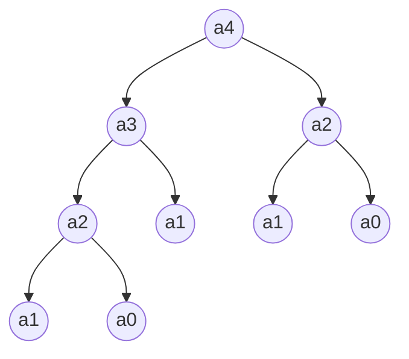

# 구현
## 재귀 (recursion)
### 시간복잡도
$$O(2^n)$$
### 구조도

## 동적 계획법 (Dynamic Programming)
### 시간복잡도
$$O(n)$$
### 구조도
<iframe src="https://sogang365-my.sharepoint.com/:u:/g/personal/dongwook_chan_o365_sogang_ac_kr/ESHuONeMDZpClIfl3WgB-ZoBsLIwEG30b0uwUYiMUpIkgw?e=o36wuK"></iframe>

## 분할 정복 (Divide and Conquer)
### 시간복잡도
$$O(logn)$$
### 수식
$\begin{bmatrix}1 & 1\\1 & 0\end{bmatrix} \begin{bmatrix}a_1\\a_0\end{bmatrix} = \begin{bmatrix}a_2\\a_1\end{bmatrix}$

$\begin{bmatrix}1 & 1\\1 & 0\end{bmatrix}^n \begin{bmatrix}a_1\\a_0\end{bmatrix} = \begin{bmatrix}a_{n+1}\\a_n\end{bmatrix}$

$\begin{bmatrix}1 & 1\\1 & 0\end{bmatrix}^n \begin{bmatrix}1\\0\end{bmatrix} = \begin{bmatrix}a_{n+1}\\a_n\end{bmatrix}$
