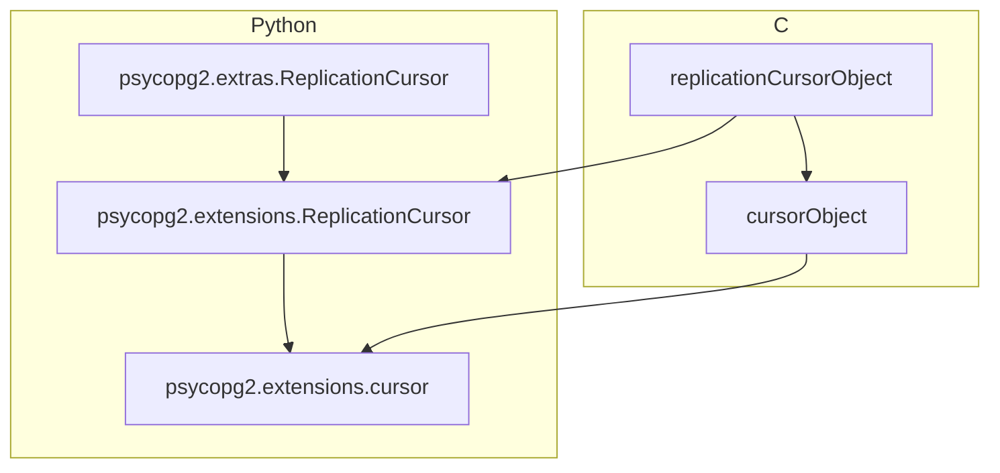
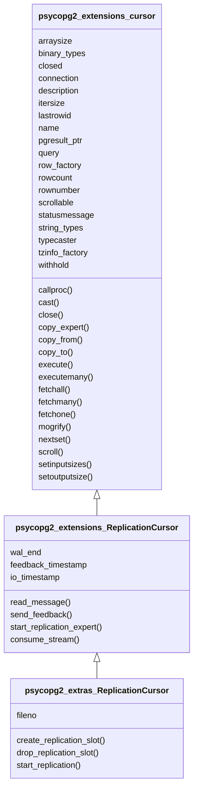

# Message Layout
[Description in Psycopg2 Documentation](https://www.psycopg.org/docs/extras.html?highlight=payload#psycopg2.extras.ReplicationMessage)

1. cursor
2. payload
3. data_size
4. data_start
5. wal_end
6. send_time

## 1. Cursor
### Mapping and Inheritance

 



### Layout of Cursor

![](https://mermaid.ink/img/eyJjb2RlIjoiICAgIGNsYXNzRGlhZ3JhbVxuICAgICAgICAlJSBDIGNsYXNzZXNcbiAgICAgICAgJSUgY2xhc3MgY3Vyc29yT2JqZWN0IHtcbiAgICAgICAgJSUgfVxuICAgICAgICAlJSBjbGFzcyByZXBsaWNhdGlvbkN1cnNvck9iamVjdCB7XG4gICAgICAgICUlIH1cblxuICAgICAgICAlJSBQeXRob24gY2xhc3Nlc1xuICAgICAgICBjbGFzcyBwc3ljb3BnMl9leHRlbnNpb25zX2N1cnNvciB7XG4gICAgICAgICAgICBhcnJheXNpemVcbiAgICAgICAgICAgIGJpbmFyeV90eXBlc1xuICAgICAgICAgICAgY2FsbHByb2MoKVxuICAgICAgICAgICAgY2FzdCgpXG4gICAgICAgICAgICBjbG9zZSgpXG4gICAgICAgICAgICBjbG9zZWRcbiAgICAgICAgICAgIGNvbm5lY3Rpb25cbiAgICAgICAgICAgIGNvcHlfZXhwZXJ0KClcbiAgICAgICAgICAgIGNvcHlfZnJvbSgpXG4gICAgICAgICAgICBjb3B5X3RvKClcbiAgICAgICAgICAgIGRlc2NyaXB0aW9uXG4gICAgICAgICAgICBleGVjdXRlKClcbiAgICAgICAgICAgIGV4ZWN1dGVtYW55KClcbiAgICAgICAgICAgIGZldGNoYWxsKClcbiAgICAgICAgICAgIGZldGNobWFueSgpXG4gICAgICAgICAgICBmZXRjaG9uZSgpXG4gICAgICAgICAgICBpdGVyc2l6ZVxuICAgICAgICAgICAgbGFzdHJvd2lkXG4gICAgICAgICAgICBtb2dyaWZ5KClcbiAgICAgICAgICAgIG5hbWVcbiAgICAgICAgICAgIG5leHRzZXQoKVxuICAgICAgICAgICAgcGdyZXN1bHRfcHRyXG4gICAgICAgICAgICBxdWVyeVxuICAgICAgICAgICAgcm93X2ZhY3RvcnlcbiAgICAgICAgICAgIHJvd2NvdW50XG4gICAgICAgICAgICByb3dudW1iZXJcbiAgICAgICAgICAgIHNjcm9sbCgpXG4gICAgICAgICAgICBzY3JvbGxhYmxlXG4gICAgICAgICAgICBzZXRpbnB1dHNpemVzKClcbiAgICAgICAgICAgIHNldG91dHB1dHNpemUoKVxuICAgICAgICAgICAgc3RhdHVzbWVzc2FnZVxuICAgICAgICAgICAgc3RyaW5nX3R5cGVzXG4gICAgICAgICAgICB0eXBlY2FzdGVyXG4gICAgICAgICAgICB0emluZm9fZmFjdG9yeVxuICAgICAgICAgICAgd2l0aGhvbGRcbiAgICAgICAgfVxuICAgICAgICBjbGFzcyBwc3ljb3BnMl9leHRlbnNpb25zX1JlcGxpY2F0aW9uQ3Vyc29yIHtcbiAgICAgICAgICAgIHJlYWRfbWVzc2FnZSgpXG4gICAgICAgICAgICBzZW5kX2ZlZWRiYWNrKClcbiAgICAgICAgICAgIHN0YXJ0X3JlcGxpY2F0aW9uX2V4cGVydCgpXG4gICAgICAgICAgICB3YWxfZW5kXG4gICAgICAgICAgICBmZWVkYmFja190aW1lc3RhbXBcbiAgICAgICAgICAgIGNvbnN1bWVfc3RyZWFtKClcbiAgICAgICAgICAgIGlvX3RpbWVzdGFtcFxuICAgICAgICB9XG4gICAgICAgIGNsYXNzIHBzeWNvcGcyX2V4dHJhc19SZXBsaWNhdGlvbkN1cnNvciB7XG4gICAgICAgICAgICBmaWxlbm9cbiAgICAgICAgICAgIGNyZWF0ZV9yZXBsaWNhdGlvbl9zbG90KClcbiAgICAgICAgICAgIGRyb3BfcmVwbGljYXRpb25fc2xvdCgpXG4gICAgICAgICAgICBzdGFydF9yZXBsaWNhdGlvbigpXG4gICAgICAgIH1cblxuXG4gICAgICAgICUlIGMg7IOB7IaNXG4gICAgICAgICUlIGN1cnNvck9iamVjdCA8fC0tIHJlcGxpY2F0aW9uQ3Vyc29yT2JqZWN0XG5cblxuICAgICAgICAlJSBweXRob24g7IOB7IaNXG4gICAgICAgIHBzeWNvcGcyX2V4dGVuc2lvbnNfY3Vyc29yIDx8LS0gcHN5Y29wZzJfZXh0ZW5zaW9uc19SZXBsaWNhdGlvbkN1cnNvclxuICAgICAgICBwc3ljb3BnMl9leHRlbnNpb25zX1JlcGxpY2F0aW9uQ3Vyc29yIDx8LS0gcHN5Y29wZzJfZXh0cmFzX1JlcGxpY2F0aW9uQ3Vyc29yXG5cblxuICAgICAgICAlJSBjIC0gcHl0aG9uIOunpO2VkVxuXG4gICAgICAgICUlIHBzeWNvcGcvY3Vyc29yX3R5cGUuYzpjdXJzb3JPYmplY3RfbWV0aG9kc1tdLCBjdXJzb3JPYmplY3RfbWVtYmVyc1tdLCBjdXJzb3JPYmplY3RfZ2V0c2V0c1tdXG4gICAgICAgICUlIGN1cnNvck9iamVjdCAtLSBwc3ljb3BnMl9leHRlbnNpb25zX2N1cnNvclxuXG4gICAgICAgICUlIHBzeWNvcGcvcmVwbGljYXRpb25fY3Vyc29yX3R5cGUuYzpyZXBsaWNhdGlvbkN1cnNvck9iamVjdF9tZXRob2RzW10sIHJlcGxpY2F0aW9uQ3Vyc29yT2JqZWN0X21lbWJlcnNbXSwgcmVwbGljYXRpb25DdXJzb3JPYmplY3RfZ2V0c2V0c1tdXG4gICAgICAgICUlIHJlcGxpY2F0aW9uQ3Vyc29yT2JqZWN0IC0tIHBzeWNvcGcyX2V4dGVuc2lvbnNfUmVwbGljYXRpb25DdXJzb3IgKCkiLCJtZXJtYWlkIjp7InRoZW1lIjoiZGFyayJ9LCJ1cGRhdGVFZGl0b3IiOmZhbHNlLCJhdXRvU3luYyI6ZmFsc2UsInVwZGF0ZURpYWdyYW0iOmZhbHNlfQ)

 



## 2. Payload
Same as [result of pg_logical_slot_get_changes](https://www.postgresql.org/docs/current/logicaldecoding-example.html)

## 3. data_size
The raw size of the message payload (before possible unicode conversion).

## 4. data_start
LSN position of the start of the message.

## 5. wal_end
LSN position of the current end of WAL on the server.

## 6. send_time
The server timestamp at the moment when the message was sent in microseconds.